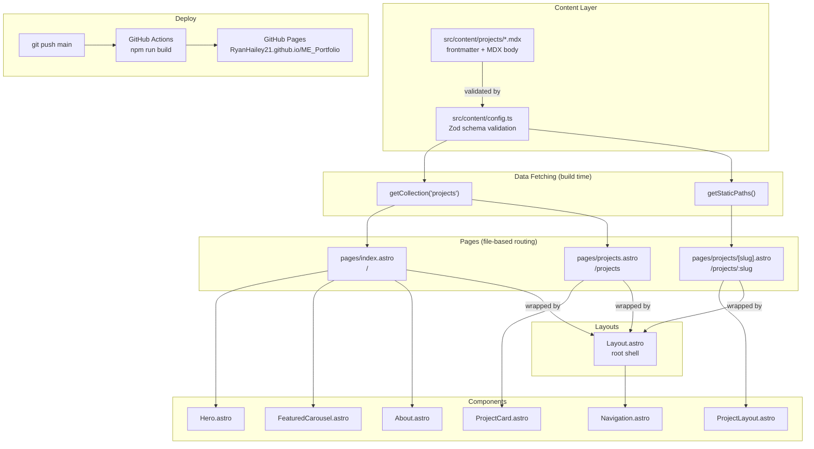

# Portfolio Architecture

Astro 5 + MDX + Tailwind CSS static site. Deployed to GitHub Pages at
`https://RyanHailey21.github.io/ME_Portfolio`.

---

## Directory Map

```
ME_Portfolio/
├── public/                          Static assets served as-is
│   ├── favicon.png
│   ├── .nojekyll                    Disables Jekyll on GitHub Pages
│   └── videos/
│       └── TouchScreenVideo.MP4
│
├── src/
│   ├── assets/images/               Processed by Astro's image pipeline
│   │   ├── Profile Photo.webp       Hero avatar
│   │   └── projects/                One subfolder per project
│   │       ├── air-cushion-suspension-analysis/
│   │       ├── autonomous-ugv/
│   │       ├── bottle-service/
│   │       ├── suspension-system-estimation/
│   │       ├── thermal-conduction-modeling/
│   │       ├── this-website/
│   │       ├── touchscreen-platform/
│   │       └── wheel-cover/
│   │
│   ├── content/
│   │   ├── config.ts                Zod schema for projects collection
│   │   └── projects/                One .mdx file per project
│   │       ├── air-cushion-suspension-analysis.mdx
│   │       ├── autobalancing-platform.mdx
│   │       ├── autonomous-ugv.mdx
│   │       ├── bottle-service.mdx
│   │       ├── robot-wheel-cover.mdx
│   │       ├── suspension-system-estimation.mdx
│   │       ├── thermal-conduction-modeling.mdx
│   │       └── this-website.mdx
│   │
│   ├── layouts/
│   │   ├── Layout.astro             Root HTML shell — Navigation + slot
│   │   └── ProjectLayout.astro      Project detail wrapper — image, video,
│   │                                MDX slot, tech tags, GitHub link
│   │
│   ├── components/
│   │   ├── Navigation.astro         Fixed header, nav links, social icons,
│   │   │                            mobile hamburger drawer
│   │   ├── Hero.astro               Landing section — name, bio, CTA buttons,
│   │   │                            profile photo with decorative frame
│   │   ├── FeaturedCarousel.astro   Auto-rotating project showcase (3.5s)
│   │   │                            with fade transitions and dot nav
│   │   ├── About.astro              Bio, skill tags, interests, education cards
│   │   └── ProjectCard.astro        Grid card — image, title, description, tags
│   │
│   └── pages/
│       ├── index.astro              / — Hero → FeaturedCarousel → About
│       ├── projects.astro           /projects — full grid + client tag filter
│       └── projects/
│           └── [slug].astro         /projects/:slug — SSG detail pages
│
├── astro.config.mjs                 Integrations, base path, Vite config
├── tailwind.config.mjs              Color tokens, fonts, animations
├── tsconfig.json
└── CLAUDE.md                        AI assistant instructions
```

---

## Mermaid Diagram



---

## Component Tree

```
Layout.astro  (every page)
└── Navigation.astro  (fixed, always rendered)
└── <slot>
    ├── index.astro
    │   ├── Hero.astro
    │   ├── FeaturedCarousel.astro   ← receives projects[] from getCollection()
    │   └── About.astro
    │
    ├── projects.astro
    │   └── ProjectCard.astro × N   ← one per collection entry
    │
    └── projects/[slug].astro
        └── ProjectLayout.astro
            ├── Title block
            ├── Hero image
            ├── Video embed (optional)
            ├── <slot>  ← compiled MDX body
            ├── Technologies tag grid
            └── GitHub link (optional)
```

---

## Data Flow

```
src/content/projects/*.mdx
        │
        │  frontmatter validated by Zod (config.ts)
        ▼
 getCollection('projects')
        │
        ├──▶  index.astro
        │         maps entries → { title, description, imageSrc, tags, slug }
        │         passes array to FeaturedCarousel
        │
        ├──▶  projects.astro
        │         maps entries → ProjectCard props
        │         client-side JS filters visible cards by active tags
        │
        └──▶  projects/[slug].astro
                  getStaticPaths() → one route per entry
                  entry.render()   → {Content} MDX component
                  passes entry.data as frontmatter prop to ProjectLayout
```

---

## Routing

| URL | File |
|-----|------|
| `/ME_Portfolio/` | `src/pages/index.astro` |
| `/ME_Portfolio/projects` | `src/pages/projects.astro` |
| `/ME_Portfolio/projects/autobalancing-platform` | `src/pages/projects/[slug].astro` |

All internal links are constructed with `import.meta.env.BASE_URL` to handle
the `/ME_Portfolio` base path. Never hardcode `/projects` — always
`` `${baseUrl}/projects` ``.

---

## Design Tokens (tailwind.config.mjs)

| Token | Value | Usage |
|-------|-------|-------|
| `ink` | `#0A0A0B` | Page background |
| `ink-card` | `#16161A` | Card / panel backgrounds |
| `ink-line` | `#262629` | Borders |
| `chalk` | `#EAEAEC` | Primary text |
| `chalk-secondary` | `#9A9AA8` | Body text |
| `chalk-muted` | `#5A5A6A` | Labels, captions |
| `brass` | `#D4A843` | Accent — used sparingly |
| `font-display` | Cormorant Garamond | Headings |
| `font-sans` | DM Sans | Body |
| `font-mono` | JetBrains Mono | Labels, tags, code |

---

## Content Schema (src/content/config.ts)

```ts
{
  title:        string           // required
  description:  string           // required, keep under 200 chars
  image:        image()          // required, Astro image type
  tags:         string[]         // required — used for filtering
  technologies: string[]         // required — shown on detail page
  githubUrl?:   string           // optional
  videoUrl?:    string           // optional — local path or YouTube embed URL
}
```

**Common tags:** `Code`, `Research`, `Design`, `Hardware`, `Matlab`, `CAD`,
`FEA`, `Python`, `C`, `C++`, `JavaScript`, `Miscellaneous`

---

## Build & Deploy

```
git push main
      │
      ▼
GitHub Actions (.github/workflows/astro.yml)
      │  npm run build
      ▼
dist/  →  GitHub Pages
           https://RyanHailey21.github.io/ME_Portfolio
```

Images are optimized at build time. All pages are pre-rendered (SSG) — no
server or runtime required.
